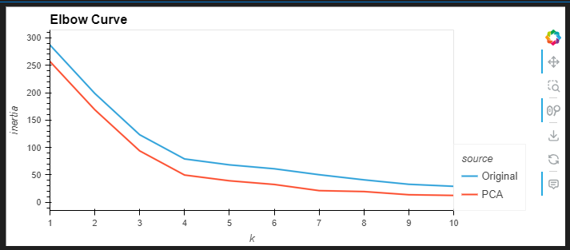
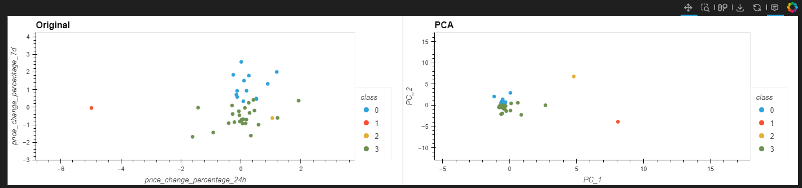

# CryptoClustering
In this exercise we compare Kmeans using original data (with 7 features) and PCA (Principle Component Analysis) using 3 features.  
Using elbow method we find the best value for k (number of clusters).
  
Then we do a PCA on the original scaled and standardized data, and apply Kmeans clustering again.
This results in a more distinct clustering.
Using hvplot, it allows us to interact with the plot by zooming and panning as well as showing the data point details when hovered on.

